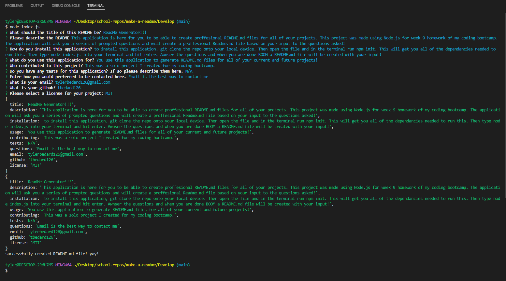

# ReadMe Generator!!!
  

            
## Table of Contents:
1. [Description](#description)
2. [Installation](#installation)
3. [Usage](#usage)
4. [Contributing](#contributing)
5. [Tests](#tests)
6. [Questions](#questions)
7. [License](#license)

## Description:
This application is here for you to be able to create proffesional README.md files for all of your projects. This project was made using Node.js for week 9 homework of my coding bootcamp. The application will ask you a series of prompted questions and will create a proffesional Readme.md file based on your input to the questions asked! 

Here is a link to the video [Link](https://drive.google.com/file/d/1BN-bcMfW9K8xCq9VnjE7dd5w9F0J-2Ga/view)

## Installation:
to install this application, git clone the repo onto your local device. Then open the file and in the terminal run npm init. This will get you all of the dependancies needed to run this. Then type node index.js into your terminal and hit enter. Awnser the questions and when you are done BOOM a README.md file will be created with your input!
            
## Usage:
You use this application to generate README.md files for all of your current and future projects!
            
## Contributing:
This was a solo project I created for my coding bootcamp.
            
## Tests:
N/A
    
## Questions:
Email: tylerbedard126@gmail.com

GitHub: 
[tbedard126](https://github.com/tbedard126)

Email is the best way to contact me
## License:

  MIT
  
  
  